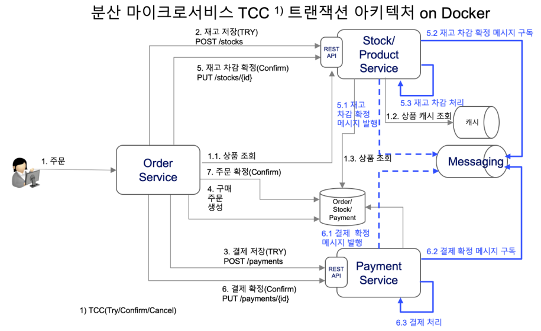

# msa-solutions
Local 3 Microservices and Solutions on docker
3개의 Microservice 와 postgres, kafka, redis를 docker images로제공하며 구성은 아래와 같습니다.
전체 7개의 앱이 실행되어 업무 PC Spec에 따라 느릴 수 있습니다.
3개의 앱이 시작되었는지 로그를 통해 확인하세요.



## Start Solutions : 
* postgres 
* kafka 
* redis 
* microservices

```
docker-compouse up -d
```
microservice and solutions 실행 확인
```
docker ps --format="table {{.Names}}\t {{.Ports}}\t {{.Image}}\t {{.ID}}"
```


## Stop Solutions 

이전데이터를 모두 삭제하고 종료
```
docker-compouse down
```

## 필수 확인 사항
order/stock/payment 시작되었는지 logs를 확인후 테스트
```
docker logs -f 컨테이너ID

[tomcat 시작확인]
Tomcat started on port(s)
```

## order service
```
http://localhost:8080/swagger-ui.html
```

## stock service
```
http://localhost:8081/swagger-ui.html
```

## payment service
```
http://localhost:8082/swagger-ui.html
```
